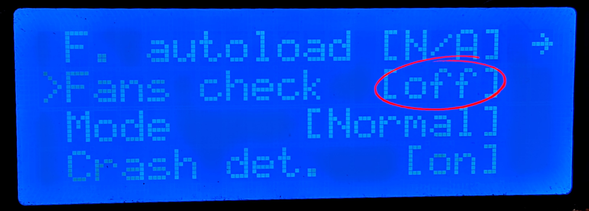

 | [Next](01_Part_Left.md)  
---
* **Do not over tighten anything!!**
* When screwing into plastic, take it slowly with firm pressure and be mindfull not to over tighten
* You will need a suitable hex driver
* The Hemera comes with some hardware like 8mm M3 + more
* Some hardware comes from disassembling the current x carriage
* Some hardware will have to be purchased like the 14mm M3
* The mod suppors thick or thin M3 square nuts
   

## Printed part cleanup requirements
* Some part have snap off brim/supports that may require a little clean up
* Some holes need to be punctured using the hex driver due to the bridging support
* The rear smooth rod clamps have built in support that needs to be removed carefully using a knife or thin metal ruler. This is made easier by inserting and removing a smooth rod before hand.  
   

## Changes in BETA printed parts
The following parts changed from using 6mm to 8mm. This is because my "M-FIX-HERMES" bag contained both 6mm and 8mm and I picked 6mm. Turns out they should not have been there.  
[**HemeraOdyssey-Undercarriage_Left.stl**](../HemeraOdyssey_STLs_BETA/HemeraOdyssey-Undercarriage_Left.stl)  
[**HemeraOdyssey-Undercarriage_Right.stl**](../HemeraOdyssey_STLs_BETA/HemeraOdyssey-Undercarriage_Right.stl)  
 

## You must use the supplied Hemera heat sink fan

**Do not use the stock Prusa fan** it does **not** have enough static pressure and you will get endless jamms.
Unfortunately the supplied fan lacks a stall sensor that the Prusa firmware uses to detect the fan stalling, consequently you have to turn off fan check: -

If you intend to run self test, then you will need to temporarily connect the original Prusa fan in order for the test to pass.
  
Connecting the provided fan to the MK3 requires you to connect the (black) ground as normal to the fan ground pin and the positive (red) goes to Pin 1 (+24v) of the J19 Raspberry Pi header.
 
Check out the great guide from Grégoire Saunier #BearUpgrade [Here](https://guides.bear-lab.com/Guide/3.+BearMera+extruder/29?lang=en#s312)
   
There are some suitable alternative fans, but a lot don't have the correct type of sensor. There is one suitable plug and play fan in development, but not available on the market yet afaik.
 
My HemeraOdyssey mod can support fans up to 15mm thick.
 
Personally I run a 5v 15mm with 6.35mm H2O static pressure but it does not have a rpm sensor. Instead the sense wire that's high when running and low when stalled.  
I made a small arduino sketch that monitors the fan then outputs a signal to the einsy that emulates 4500rpm while high and 0rpm while stalled.