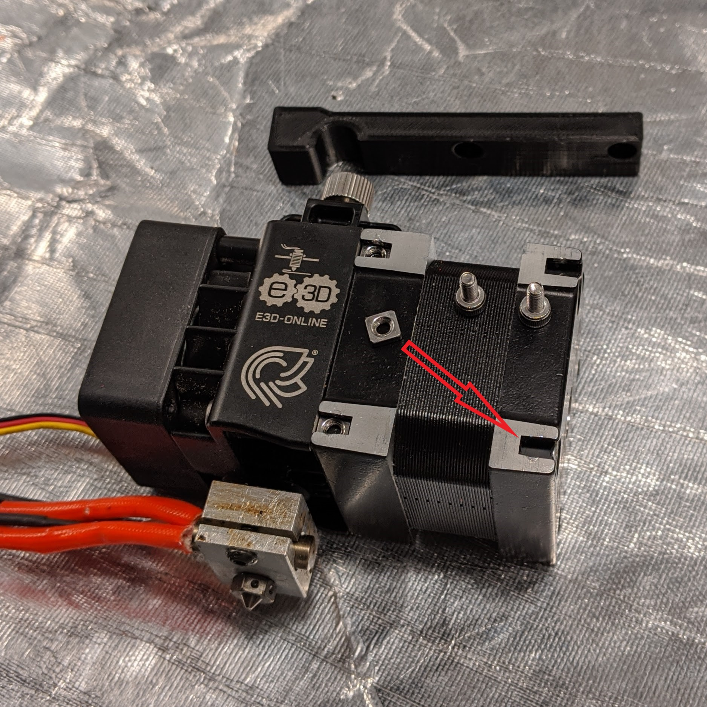
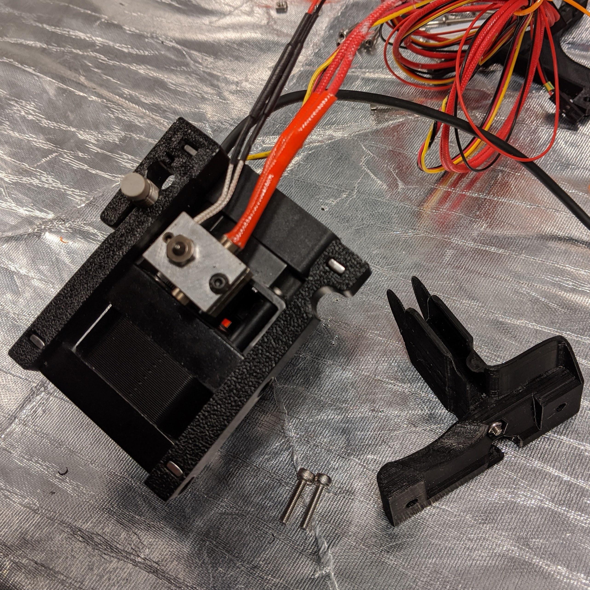

[Previous](05_Filament_Sensor.md) | [Next](07_Extruder.md)  
---
# Undercarriage
### #hemeraodyssey
---
# Parts  
|Quantity|Size|Type|
|---:|:---:|:---:|
|1|[**HemeraOdyssey-Undercarriage_Left.stl**](../HemeraOdyssey_STLs_BETA/HemeraOdyssey-Undercarriage_Left.stl)|Printed Part|
|1|[**HemeraOdyssey-Undercarriage_Right.stl**](../HemeraOdyssey_STLs_BETA/HemeraOdyssey-Undercarriage_Right.stl)|Printed Part|
|1|[**HemeraOdyssey-Undercarriage_Back.stl**](../HemeraOdyssey_STLs_BETA/HemeraOdyssey-Undercarriage_Back.stl)|Printed Part|
|5|M3|Square Nut|
|4|M3|Thin Square Nut (Hemera)|
|2|6mm|M3 Bolt (Hemera)|
|1|10mm|M3 Bolt|
|2|14mm|M3 Bolt|
|1|40mm|M3 Bolt|
|1|M3|Hex Nylon Lock Nut|
---
* Ensure the Hemera is assembled according to [E3D build guide](https://e3d-online.dozuki.com/c/Hemera_Assembly_Guides)
* Do **not** use the stock Noctua fan, you will only get jamms
* The only recommended fan is the one provided with the Hemera, see [here](00_First.md) for more details   

---
* Insert 1x 40mm bolt into the undercarriage back and secure with a hex nylon lock nut, tighten completely
* This provides strength   

---
* The undercarriage left requires 2x square nuts
* The undercarriage right requires 3x square nuts   

---
* Insert 1x thin square nut into the hemera mounting hole and secure the undercarriage left with 2x 6mm bolts   
 

---
* Insert 1x thin square nut into the hemera mounting hole and secure the undercarriage right with 2x 6mm bolts   

---
* Insert the PINDA probe and secure in place with 1x 10mm bolt
* Use the front(motor side) hole for MK3/MK2.5 and the rear(fan side) hole for MK2 only   

---
* Take extra care here not to damage the thermistor or heater cartridge by yanking on the cables
* Get the undercarriage back part and 2x 14mm bolts   

---
* Carefully feed the thermistor cables as pictured   

---
* Carefully feed the heater cartridge cables as pictured
* It make take some gentle coercing to get them to sit correctly
* The undercarriage back should already be close to final position before securing in place with 2x 14mm bolt
* If the undercarriage back is not close, gently pull the cables through one by one, bit by bit taking particular care not to yank the cables   

[Previous](05_Filament_Sensor.md) | [Next](07_Extruder.md)  