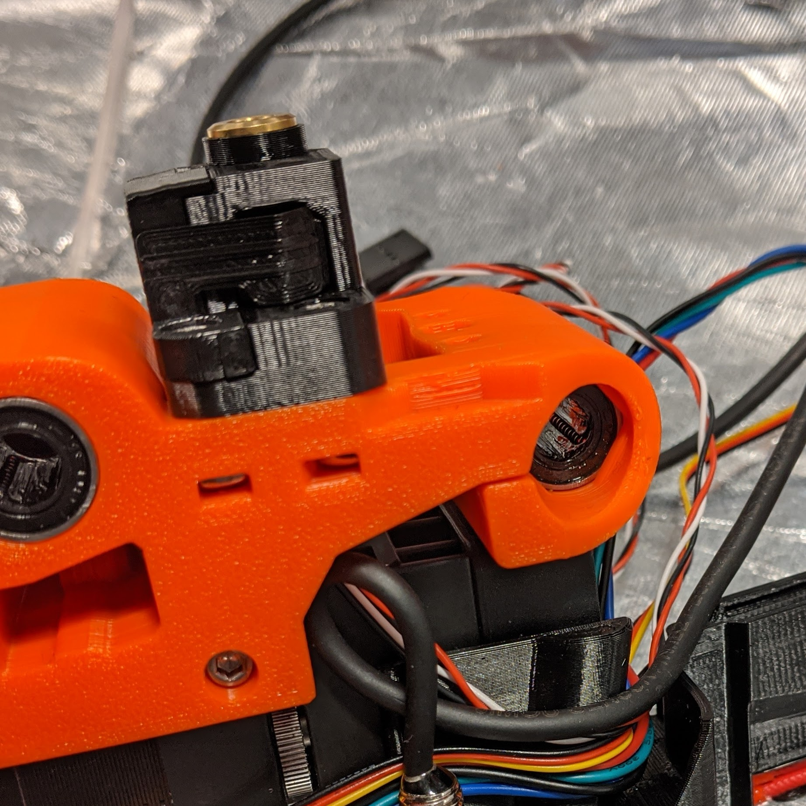

[Previous](06_Undercarriage.md) | [Next](08_Cables.md)  
---
# Extruder
### #hemeraodyssey
---
# Parts  
|Quantity|Size|Type|
|---:|:---:|:---:|
|1|[**HemeraOdyssey-X_Carriage.stl**](../HemeraOdyssey_STLs_BETA/HemeraOdyssey-X_Carriage.stl)|Printed Part|
|1|[**HemeraOdyssey-X_Carriage_Washer.stl**](../HemeraOdyssey_STLs_BETA/HemeraOdyssey-X_Carriage_Washer.stl)|Printed Part|
|1|[**HemeraOdyssey-Nozzle_Fang.stl**](../HemeraOdyssey_STLs_BETA/HemeraOdyssey-Nozzle_Fang.stl)|Printed Part|
|4|10mm|M3 Bolt|
|2|16mm|M3 Bolt|
|2|25mm|M3 Bolt|
|2|M3|Thin Square Nut (Hemera)|
|2|M3|Washer|
|1|43mm|PTFE Tube|
|1|Small|zip tie|
---
### 01
* Get the X carriage part + washer part, 4x 10mm bolts and 2x thin square nuts   

---
### 02
* Place the printed washer part onto the X carriage as pictured   

---
### 03
* Insert 2x thin square nuts into the mounting holes on the hemera and ensuring you don't tip them out
* If you find this difficult to achieve, you can leave them out until the next step   

---
### 04
* Place the X carriage over the Hemera mounting holes as pictured
* Insert the 2x thin square nuts into the mounting slots if they have fallen out by this point   

---
### 05
* Secure the X carriage to the hemera using 4x 10mm bolts, do *not* over tighten   

---
### 06
* Get the nozzel fang, undercarriage fan mount, 2x 16mm bolt, 2x Hex Nylon Lock Nut and motor cable   

---
### 07
* **Make sure the plastic sleeve is removed from the motor cable**
* Connect the motor cable and guide it to the back passing behind the pinda   

---
### 08
* Insert 2x Hex Nylon Lock Nut onto the printed undercarriage fan mount. You can use a spare 10mm bolt to bed them
* Place the undercarriage fan mount against the nozzle fang and insert 2x 16mm bolts to hold it in place   

---
### 09
* Secure the nozzle fang and undercarriage fan mount to the undercarriage assembly as pictured by tightening the 2x 16mm bolts   

---
### 10
* Secure the 50mm blower fan using 2x 25mm bolt with 2x M3 washers
* Guide the fan cable the same way as the motor cable   

---
### 11
* Secure the motor and fan cable to the undercarraige rigth part using a small zip tie   

---
### 12
* Insert the 43mm PTFE tube into the hemera   

---
## Laser Filament Sensor
* Attach the dupont connector to the sensor
* Feed the cable through the opening of the X Carriage down past the PINDA
* Place the cable in the slot on the underside of the sensor housing
* Locate the PTFE tube and isert into the sensor housing
* Secure the sensor housing in the corner as pictured, ensuring not to pinch the cable   

 

---
## IR Filament Sensor
* Attach the dupont connector to the sensor
* Feed the cable through the opening of the X Carriage down past the PINDA
* Secure the sensor as pictured using 2x 14mm bolts   

---
[Previous](06_Undercarriage.md) | [Next](08_Cables.md)   