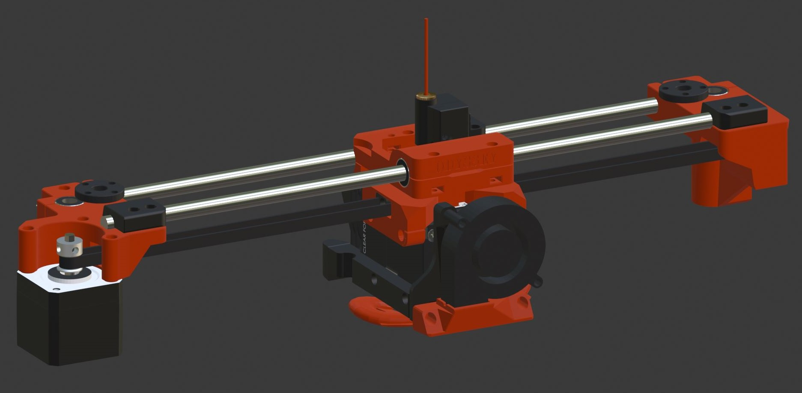

## HemeraOdyssey **BETA** (v1.0)
Universal E3D Hemera mod for the Prusa i3 MK2 MK2.5 MK2.5S MK3 MK3S  
This is for advanced users so **please** fully read this [README.md](README.md) to avoid disappointment, frustration and missguided expectations!

### Print settings are critical please follow them exactly  
=> [**Print Settings**](Print_Settings.md)

### Build guide
=> [**Build guide**](Build_Guide/00_First.md)

## This is a **BETA** mod!
I have to stress this is a **beta** mod with beta documentation.  
What this means is field testing of parts and printing parts is **limited**.
Some parts mite cause problems when printing especially with materials I haven't tested.
I will attempt to deal with any highlighted issue in a timely fasion, that said, changes will be kept to a minimum if possible.
Documentation will change over time.

## What is this mod
This is a universal one fits all mod that enabled the use of the E3D Hemera extruder on a Prusa i3 MK2/S MK2.5/S MK3/S without needing custom firmware (sort of).  
It will pass the self-test and XYZ calibration thanks to the geometry matching the stock setup but needs a minimum change to the e-steps that can be done via gcode.  
This is a very maintainable and moddable mod. I encourage and look forward to seeing mods and remixes!

## No custom firmware (sort of)???!!!
Aside from needing to change the e-steps, this will work with stock firmware but it's not ideal.
The menu unload can cause a blob of filament to be pinched off below the hobbed gears. This in turn causes a filament jam that would then need clearing by dismantling the extruder.
On the MK3, the e-current will need to be increased slightly because the motor is 1.3A vs stock at 1.0A otherwise a moiré pattern is more visible than usual.

## Please respect the LICENSE this mod is released under
Please respect the GNU General Public License v3.0 that this mod is released under. This is the same license that Prusa use.

## MMU2 Support?
Not yet but it is intended but for this to work it will require custom firmware that will come at a later date.

## Caveats
I showed a preview of my mod a few weeks back and there was a voice of concern in regard to the center of mass moving forward on the X carriage.  
This was mainly because the X motor is now positioned forward compared to stock.  
The concern is that this now unfavorably loads the z axis bearing and in turn reduces the life of the bearings and smooth rods.  
I have not been able to find data that supports or refutes this concern, however it does appear that the extra loading is within spec.  
So what does this mean? It mite, or mite not reduce the life of your z axis bearings and smooth rods.

The x carriage is slightly heavier than stock so this could manifest as more ghosting from x movements. Print settings can be adjusted to counter this.

## Source Files
I used Blender to create the files for this mod so only the blender file and STL files will are available

## Huge thanks to
 
[Vlastimil Hovan on twitter](https://twitter.com/Vlastimil_Hovan)  
Vlastimil has beta tested my mod, printed several variations and tried them out on his machines. Also has given invaluable and suggestions that made their way back into the design.
Not only that but he has created the first official mod for my mod that enables the use on the MK3S variant, so again I huge respect and thanks to him.  
   
[Grégoire Saunier #BearUpgrade on twitter](https://twitter.com/GregoireSaunier)  
Grégoire has not only been inspiration but has also been kind enough to offer some guidance here and there that kept me on the strain and narrow :) so I have huge respect and thanks to him. 

## Lots of coffee and filament consumption
In making this mod I've used several rolls of filament and drank lots of Grumpy mule coffee. If you like it and want to support me in some way (obiously no obligation) maybe consider buying me a coffee :)  
https://www.buymeacoffee.com/tetra3dprint

## Sources
* Prusa: http://www.prusa3d.com
* E3D Hemera: https://e3d-online.com/
* Blender 3D: https://www.blender.org/
